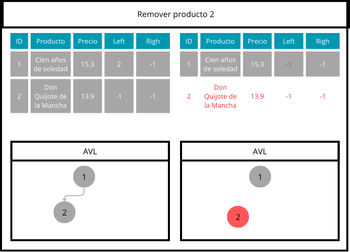

# Proyecto 1

# Autores

|                                                            | Nombre                                                                   | GitHub                                                     |
| ---------------------------------------------------------- | ------------------------------------------------------------------------ | ---------------------------------------------------------- |
|        | [Mariel Carolina Tovar Tolentino](https://github.com/MarielUTEC)         | [@MarielUTEC](https://github.com/MarielUTEC)               |
|  | [Noemi Alejandra Huarino Anchillo](https://github.com/NoemiHuarino-utec) | [@NoemiHuarino-utec](https://github.com/NoemiHuarino-utec) |

# Introducción

## Objetivo

El proyecto Data Fusion DB busca diseñar e implementar un mini gestor de bases de datos que integre técnicas avanzadas de organización e indexación de archivos. Estas técnicas incluyen **Sequential File**, **AVL File** y **Extendible Hashing**, permitiendo una administración eficiente de datos estructurados. El sistema está orientado a optimizar operaciones críticas como inserción, eliminación y búsqueda, asegurando un manejo eficaz y escalable de grandes volúmenes de datos.

Como parte del proyecto, se desarrollará también un parser de código SQL que permita interpretar y ejecutar sentencias clave, como la creación de tablas, consultas, inserciones y eliminaciones.

## Dominio de datos

Para el desarrollo del proyecto, se utilizó un dominio de datos basado en un conjunto sintético generado con la librería `Faker` en Python. Este conjunto representa información demográfica y económica de individuos, incluyendo los siguientes atributos:

- **DNI**: Número único de 8 dígitos que identifica a cada individuo.
- **Nombre**: Nombre completo del individuo, generado en español.
- **Ocupación**: Profesión o trabajo, seleccionada de un conjunto predefinido.
- **Estado Civil**: Clasificación del estado marital (soltero/a, casado/a, divorciado/a, viudo/a).
- **Ingreso Mensual**: Salario estimado en un rango entre 1,000 y 20,000 soles.
- **Edad**: Edad del individuo, comprendida entre 18 y 80 años.
- **Sexo**: Género del individuo (F o M).

En nuestro código se visualiza de la siguiente manera:

```c++
struct Record
{
  long dni;                // Documento Nacional de Identidad
  char nombre[200];        // Nombre completo
  char ocupacion[200];     // Ocupación
  char estado_civil[200];  // Estado civil
  long ingreso_mensual;    // Ingreso mensual
  int edad;                // Edad
  char sexo[2];            // Sexo (M/F)
}
```

El conjunto de datos consta de **20,000 registros** almacenados en un archivo plano llamado `AdultDataset.csv`, preparado para evaluar las operaciones de organización e indexación implementadas. La elección de este dominio permite simular un caso práctico realista, común en aplicaciones de sistemas de gestión de bases de datos.

## Resultados esperados

Se espera implementar un sistema eficiente que permita minimizar los accesos a memoria secundaria durante las operaciones de manipulación de datos. Esto incluye garantizar tiempos de respuesta óptimos y mantener la escalabilidad en la ejecución de tareas críticas como búsqueda, inserción y eliminación. Además, los resultados incluirán un análisis comparativo del desempeño de las técnicas empleadas, destacando su efectividad en diferentes escenarios.

# Técnicas Utilizadas

En este proyecto se implementaron tres técnicas avanzadas de organización e indexación de archivos en memoria secundaria. A continuación, se describen las técnicas seleccionadas, sus principios básicos y su implementación en el contexto del proyecto.

## AVL

El uso de AVL proporciona una mayor eficiencia en la búsqueda y gestión de registros individuales debido a su naturaleza balanceada. Es una técnica ideal para aplicaciones que requieren búsquedas frecuentes y eficientes de registros o consultas por rangos.

El árbol AVL en este proyecto se implementa como un archivo indexado en memoria secundaria, donde cada nodo corresponde a un registro almacenado físicamente. Las operaciones principales incluyen inserción, búsqueda, búsqueda por rango y eliminación, garantizando el equilibrio del árbol mediante rotaciones simples y dobles.

Cada nodo del árbol (implementado en la clase `Nodo`) contiene:

- **Llave primaria (`key`)**: En este caso, corresponde al campo `dni` del registro.
- **Información del registro (`record`)**: Los datos asociados al nodo.
- **Posición en el archivo (`pos`)**: Localización física del nodo en el archivo.
- **Punteros a hijos (`left` y `right`)**: Punteros a los nodos hijo izquierdo y derecho.
- **Altura del nodo (`height`)**: Utilizada para calcular el factor de balanceo.
- **Siguiente nodo eliminado (`next_del`)**: Referencia para reutilizar posiciones en el archivo.

### Inserción (`add`)

El proceso de inserción sigue estos pasos:

1. **Verificación de posición vacía**:

   - Si el árbol está vacío, el registro se inserta como raíz.
   - Si hay nodos eliminados disponibles, se reutiliza su posición.

2. **Descenso por el árbol**:

   - Si la clave es menor que la del nodo actual, se desciende por el subárbol izquierdo.
   - Si es mayor, por el subárbol derecho.

3. **Inserción del nodo**:

   - El nuevo nodo se inserta como hoja.

4. **Balanceo del árbol**:
   - Se actualiza la altura del nodo.
   - Se calcula el factor de balanceo y, si es necesario, se realizan rotaciones (izquierda, derecha, o combinadas).

### Rotaciones

Las rotaciones se utilizan para mantener el árbol balanceado. Existen dos tipos principales de rotaciones simples y sus variantes dobles:

1. **Rotación simple a la izquierda**:

   - Se utiliza cuando el subárbol derecho es más alto que el izquierdo en dos niveles, y la clave está en el subárbol derecho.

2. **Rotación simple a la derecha**:

   - Se utiliza cuando el subárbol izquierdo es más alto que el derecho en dos niveles, y la clave está en el subárbol izquierdo.

3. **Rotación doble izquierda-derecha**:

   - Se realiza una rotación simple a la izquierda en el hijo izquierdo, seguida de una rotación simple a la derecha en el nodo actual.

4. **Rotación doble derecha-izquierda**:
   - Se realiza una rotación simple a la derecha en el hijo derecho, seguida de una rotación simple a la izquierda en el nodo actual.

#### Ejemplo gráfico:


#### Búsqueda (`search`)

La búsqueda en un árbol AVL se realiza de forma binaria, asegurando eficiencia:

1. **Descenso por el árbol**:
   - Si la clave buscada es menor que la clave del nodo actual, se busca en el subárbol izquierdo.
   - Si es mayor, se busca en el subárbol derecho.
   - Si la clave coincide, el registro se añade al vector de resultados.
2. **Continuación recursiva**: La búsqueda continúa en ambos subárboles para identificar posibles duplicados.

### Búsqueda por rango (`rangeSearch`)

La búsqueda por rango en un árbol AVL en este proyecto se centra en el atributo `ingreso_mensual` de los registros almacenados. Su objetivo es encontrar todos los registros cuyos valores de ingreso mensual estén dentro de un rango específico definido por los límites `begin_key` (valor mínimo) y `end_key` (valor máximo). Esta búsqueda aprovecha la naturaleza ordenada del árbol AVL para optimizar el recorrido, limitando el acceso a nodos irrelevantes.

El funcionamiento es el siguiente:

1. **Comparación con el nodo actual:**

   - Si el atributo `ingreso_mensual` del nodo actual es **mayor o igual a `begin_key`**, significa que podrían existir valores relevantes en el subárbol izquierdo, por lo que se desciende recursivamente.
   - Si el atributo `ingreso_mensual` del nodo actual es **menor o igual a `end_key`**, significa que podrían existir valores relevantes en el subárbol derecho, por lo que se desciende recursivamente.

2. **Incluir el nodo actual:**

   - Si el valor de `ingreso_mensual` del nodo actual está dentro del rango [`begin_key`, `end_key`], el registro asociado al nodo se añade a la lista de resultados.

3. **Finalización de la búsqueda:**
   - La búsqueda se detiene cuando se alcanzan nodos nulos o cuando no hay más nodos que cumplan con las condiciones del rango.

**Ejemplo:**

Supongamos que tenemos un árbol AVL que indexa registros con los siguientes valores de `ingreso_mensual`: `1000`, `3000`, `5000`, `7000`, `9000`. Queremos buscar todos los registros cuyos valores de ingreso mensual estén en el rango `[3000, 7000]`.

- Nodo raíz (`5000`):

  - `5000` está dentro del rango `[3000, 7000]`, por lo que se incluye en los resultados.
  - Se busca recursivamente en el subárbol izquierdo para posibles valores menores.
  - Se busca en el subárbol derecho para posibles valores mayores.

- Subárbol izquierdo (`3000`):

  - `3000` está dentro del rango, por lo que se incluye en los resultados.
  - No se necesita buscar más a la izquierda porque todas las claves serán menores que `3000`.

- Subárbol derecho (`7000`):
  - `7000` está dentro del rango, por lo que se incluye en los resultados.
  - No se necesita buscar más a la derecha porque todas las claves serán mayores que `7000`.

**Ventajas de esta implementación:**

- **Eficiencia**: Al utilizar la estructura balanceada del árbol AVL, la búsqueda por rango solo explora nodos relevantes, evitando recorridos innecesarios.
- **Orden**: Los resultados se devuelven automáticamente en orden ascendente gracias a la naturaleza del árbol AVL.

### Eliminación (`remove`)

El proceso de eliminación en un árbol AVL considera tres casos principales:

1. **Nodo hoja**: Si el nodo no tiene hijos, se elimina directamente.
2. **Nodo con un hijo**: Si el nodo tiene solo un hijo, se reemplaza por su hijo.
3. **Nodo con dos hijos**:

   - Se encuentra el sucesor en el subárbol derecho (el nodo con el valor mínimo).
   - Se reemplaza el nodo actual por el sucesor.
   - Se elimina el sucesor del subárbol derecho.

4. **Balanceo después de la eliminación**: Después de eliminar un nodo, el árbol verifica si sigue equilibrado y aplica rotaciones si es necesario. Esto asegura que el tiempo de las operaciones permanezca eficiente.

Ejemplo de eliminación:  
  
  


### Complejidad de las operaciones

| Operación         | Descripción                                                            | Complejidad                                                  |
| ----------------- | ---------------------------------------------------------------------- | ------------------------------------------------------------ |
| **add()**         | Inserción en las hojas. Con rotación en caso necesario.                | O(log n)                                                     |
| **search()**      | Búsqueda binaria descendiendo por los nodos.                           | O(log n)                                                     |
| **rangeSearch()** | Búsqueda de todos los registros dentro de un rango específico.         | O(log n + k), donde k es el número de elementos en el rango. |
| **remove()**      | Eliminación de un nodo, seguida de balanceo del árbol si es necesario. | O(log n)                                                     |

## Sequential File

Este método emplea dos archivos distintos para gestionar los datos: un archivo principal `main` y un archivo auxiliar `aux`. En el archivo principal los registros se mantienen ordenados. Insertamos nuevos registros en el archivo auxiliar y luego lo juntamos con el archivo principal de forma ordenada.


### Inserción (add)

Insertamos nuevos registros al final del archivo auxiliar hasta que su tamaño sea mayor o igual al logaritmo de la cantidad de registros en el archivo main. Entonces hacemos `merge()` para poder insertar los registros del archivo auxiliar al archivo principal.

### Búsqueda

Realizamos una búsqueda binaria en el archivo principal, ya que los índices están ordenados por la llave primaria. Luego buscamos secuencialmente en los registros del archivo auxiliar.

### Merge

Ordenamos los registros ubicados en el archivo auxiliar y creamos un nuevo archivo para hacer la reconstrucción. Luego vamos insertando los registros antiguos del archivo y los registros del archivo auxiliar ordenado en el nuevo archivo, uno por uno, de forma ordenada. Por último borramos los archivos antiguos y renombramos los archivos nuevos. Al final tenemos un nuevo archivo auxiliar vacio y un archivo main ordenado.

Tenemos las siguientes complejidades en base a nuestra implementación:
| Función | Descripción | Complejidad |
|--------------------|-------------------------------------------------------------------------------------------------------|----------------------------------|
| **add()** | Inserción constante al final del archivo auxiliar. En caso de merge ordenamos archivo auxiliar y reconstruimos archivo principal insertando todos los registros nuevamente | Sin merge: O(1), Con merge: O(m log m + n) |
| **search()** | Búsqueda binaria en el archivo main, si no encuentra busca linealmente en el archivo aux | Principal: O(lg n), Auxiliar: O(m) |
| **rangeSearch()** | Búsqueda lineal en ambos archivos | Principal: O(n), Auxiliar: O(m) |
| **remove()** | Busco linealmente y sobreescribo el registro, si no encuentra busco en aux | Principal: O(n), Auxiliar: O(m) |

Cabe destacar que el archivo aux tiene maximo `lg(n)` elementos, por lo tanto la complejidad `O(m)` técnicamente es equivalente a `O(lg(n))`. Si implementamos el sequential file utilizando punteros se podría diminuir la complejidad de la inserción, ya que podríamos aprovechar los espacios vacíos de los registros borrados para poder insertar.

### Eliminación

Buscamos el key del registro por eliminarse, en ambos archivos. Luego sobreescribimos ese registro, con una llave `-1` para indicar que es un registro que fue borrado.

## Extendible Hashing

El **Extendible Hashing** es una técnica de organización de archivos que permite manejar eficientemente las operaciones de búsqueda, inserción y eliminación en estructuras dinámicas. A diferencia de métodos tradicionales como los árboles o el hashing estático, este enfoque se adapta automáticamente al crecimiento de los datos, evitando problemas de colisiones y reorganización masiva.

### Fundamentos teóricos

El Extendible Hashing utiliza una tabla de índices basada en un **hash binario**. Cada clave se transforma en un valor binario que determina la ubicación en la tabla. Este método permite manejar eficientemente colisiones y reorganizar dinámicamente la estructura cuando los datos aumentan. Los conceptos clave son:

1. **Profundidad global (`globalDepth`)**:

   - Representa el número de bits usados del hash para indexar los buckets.
   - Define la capacidad máxima actual de la tabla de índices.
   - Si se llena un bucket y no hay suficiente espacio, se incrementa esta profundidad.

2. **Profundidad local (`localDepth`)**:

   - Representa los bits usados por un bucket específico.
   - Si la profundidad local de un bucket lleno es menor que la global, se realiza una división del bucket (split), duplicando su espacio de almacenamiento.

3. **Hash dinámico**:

   - La clave se procesa con una función hash que genera un identificador binario.
   - Este identificador se trunca según la profundidad global para ubicar el bucket correspondiente.

4. **Split de buckets**:
   - Ocurre cuando un bucket se llena y su profundidad local es menor que la global.
   - Los datos se redistribuyen entre el bucket original y uno nuevo, ajustando los bits relevantes del hash.

### Implementación en este proyecto

En este proyecto, el sistema de Extendible Hashing está implementado mediante las clases `Bucket` y `ExtendibleHashing`, donde cada una desempeña roles específicos:

#### Buckets

Los buckets son la unidad básica de almacenamiento. Sus características principales incluyen:

- **\_localDepth**: Define la profundidad local del bucket, usada para distinguir datos al realizar un split.
- **\_values**: Arreglo de pares clave-valor que almacena los datos.
- **\_next**: Apuntador al siguiente bucket en caso de encadenamiento (chaining).

Las operaciones básicas en los buckets incluyen:

- **Búsqueda (`search`)**: Recorre los datos del bucket buscando una clave específica.
- **Eliminación (`remove`)**: Elimina un par clave-valor del bucket.
- **Impresión (`print`)**: Permite visualizar el contenido del bucket, útil para depuración.

#### Clase ExtendibleHashing

Esta clase gestiona la relación entre las claves y los buckets mediante una tabla de índices. Algunos aspectos clave de su funcionamiento son:

- **Tabla de índices**:

  - La tabla de índices almacena referencias a los buckets basadas en los valores truncados del hash.
  - Cada entrada en la tabla apunta a un bucket.

- **Inserción (`insert`)**:

  - Calcula el hash de la clave y localiza el bucket correspondiente.
  - Si el bucket tiene espacio, agrega el nuevo par clave-valor.
  - Si está lleno:
    - Realiza un split si la profundidad local es menor que la global.
    - Incrementa la profundidad global y ajusta la tabla de índices si la profundidad local ya coincide con la global.

- **Búsqueda (`search`)**:

  - Localiza la posición inicial del bucket correspondiente.
  - Busca la clave en dicho bucket y en los buckets encadenados si es necesario.

- **Eliminación (`remove`)**:
  - Localiza la clave en el bucket correspondiente y la elimina, ajustando el contenido del bucket.

#### Beneficios de esta implementación

- **Crecimiento dinámico**: La estructura se adapta automáticamente al volumen de datos, evitando colisiones y reorganización masiva.
- **Eficiencia en tiempo**: Tanto la búsqueda como la inserción tienen un costo constante en promedio (O(1)).
- **Manejo de colisiones**: Se emplea encadenamiento o duplicación controlada de buckets según el caso.

### Complejidades de las funciones

Tenemos las siguientes complejidades en base a nuestra implementación:

| Función                    | Descripción                                                                                   | Complejidad                                                                 |
| -------------------------- | --------------------------------------------------------------------------------------------- | --------------------------------------------------------------------------- |
| `insert`                   | Inserta un nuevo par clave-valor. Si el bucket está lleno, realiza un split o encadenamiento. | O(1) promedio, O(n) en el peor caso (split masivo)                          |
| `search`                   | Busca una clave en el bucket correspondiente y en los buckets encadenados si es necesario.    | O(1) promedio, O(log n) en el peor caso (por profundidad de encadenamiento) |
| `remove`                   | Elimina un par clave-valor del bucket y ajusta el contenido si es necesario.                  | O(1) promedio                                                               |
| `splitBucket`              | Divide un bucket en dos cuando se llena, redistribuyendo las claves según los bits del hash.  | O(n) en el peor caso                                                        |
| `getInitialBucketPosition` | Calcula la posición inicial del bucket correspondiente usando la tabla de índices.            | O(1)                                                                        |
| `getLastBucket`            | Encuentra el último bucket encadenado a partir de una posición inicial.                       | O(log(globalDepth)) en el peor caso                                         |

### Búsquedas por rango

El **Extendible Hashing** no soporta nativamente las búsquedas por rango debido a que las claves se distribuyen según su valor hash, lo que rompe el orden natural de los datos. Por esta razón, no se ha implementado una función de búsqueda por rango en este proyecto, ya que no es una operación compatible con las características del hashing.

## SQL Parser

### Descripción

Este parser permite la interpretación de instrucciones SQL comunes, como `CREATE`, `INSERT`, `DELETE`, y `SELECT`, facilitando la integración de consultas en aplicaciones que requieren manipulación de bases de datos.

### Características

- Análisis de Consultas: Capaz de procesar sentencias SQL complejas y desglosarlas en componentes estructurales, permitiendo su interpretación y ejecución.
- Soporte para Múltiples Comandos: Maneja una variedad de comandos SQL, incluyendo:
  - `CREATE TABLE`: Crea nuevas tablas en la base de datos con la posibilidad de especificar rutas de archivo y columnas clave.
  - `INSERT`: Permite la inserción de nuevos registros en las tablas existentes.
  - `DELETE`: Facilita la eliminación de registros basados en condiciones específicas.
  - `SELECT`: Realiza consultas para recuperar datos de las tablas, incluyendo la capacidad de realizar búsquedas por rango.

### Gramática del Parser

```plaintext
Program := CREATE | INSERT | DELETE | SELECT

CREATE ::= "create" "table" TABLE_ID "from" "file" filename "using" "index" structure "(" Key ")";

INSERT ::= "insert" "into" TABLE_ID "values" (unsigned long, char, char, unsigned short, char);

DELETE ::= "delete" "from" TABLE_ID "where" KEY "=" value;

SELECT ::= "select" "*" "from" TABLE_ID "where" KEY "between" value1 "and" value2
          | "select" "*" "from" TABLE_ID "where" KEY "=" value;
```

### Estructura del Parser

- Token: Representa los tokens individuales generados por el analizador léxico, incluyendo tipos como identificadores, números, palabras reservadas y símbolos.
- Scanner: Responsable de leer la entrada de texto y generar tokens. Utiliza un enfoque basado en la máquina de estados para identificar diferentes tipos de lexemas.
- Parser: La clase principal que analiza los tokens generados por el scanner y construye una representación estructural de las consultas SQL, devolviendo objetos de declaración (como `CreateTableStatement`).
- Declaraciones: Clases que representan las diversas instrucciones SQL, como `CreateTableStatement`, `InsertStatement`, y `DeleteStatement`.

### Ejemplos de uso

    // Parser para leer una consulta
    const char* input = "create table Books from file \"data.csv\" using index sequential(ISBN);";
    const char* input2 = "insert into Books values (\"9783161484100\", \"The Catcher in the Rye\", \"J D Salinger\", 1951, \"Brown and Company\");";
    const char* input3 = "select * from Books where ISBN = 9783161484100;";
    const char* input4 = "delete from Books where ISBN = 9783161484100;";
    const char* input5 = "select * from Books where ISBN between 11 and 50;";

    // Crea un scanner con la consulta
    Scanner* scanner = new Scanner(input); // Cambiar `input1` a `input2`, `input3` o `input4` para otras consultas
    Parser* parser = new Parser(scanner);

# Resultados experimentales

## Inserción

## Búsqueda

# Pruebas de uso

La implementación de una GUI utilizando librerías queda pendiente.

# Video

A continuación se adjunta el video donde explicamos el funcionamiento del proyecto:
